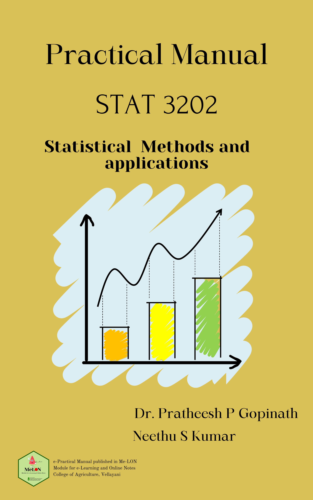

---
title: "PRACTICAL MANUAL OF STAT 3202"
author: "Dr. Pratheesh P. Gopinath & Neethu S Kumar"
date: "2022-01-30"
site: bookdown::bookdown_site
documentclass: book
bibliography: [book.bib]
biblio-style: apalike
link-citations: yes
github-repo: https://github.com/KAUMELON/stat3202
description: "A BOOK FOR UNDERGRADUATE PROGRAMME IN AGRICULTURE"
cover-image: images/coverpage.PNG  
---  

# Welcome {-} 
<p style="text-align: center;"><a href="https://coavellayani.kau.in/people/dr-pratheesh-p-gopinath"></a></p>  
Welcome to the book **PRACTICAL MANUAL OF STATISTICAL METHODS AND APPLICATIONS (STAT 3202)**.

# Preface {-}  
<p style="text-align: justify;">
</p>  


<p style="text-align: justify;"> **Note**: This book is published in MeLoN (Module for e-Learning & Online Notes) . The online version of this book is free to read here. You can download the PDF and take print out while submitting the records.</p> 
````{=html}
<a rel="license" href="http://creativecommons.org/licenses/by-nc-nd/4.0/"></a><br />This work is licensed under a <a rel="license" href="http://creativecommons.org/licenses/by-nc-nd/4.0/">Creative Commons Attribution-NonCommercial-NoDerivatives 4.0 International License</a>.
````
<p>If you have any feedback, please feel free to contact [Dr.Pratheesh P. Gopinath](https://coavellayani.kau.in/people/dr-pratheesh-p-gopinath). E-mail: _pratheesh.pg@kau.in_. Thank you!</p>  

<p>This is a Practical Manual of STAT 3202 covering the syllabus of statistics course in B.Sc.(Hons.) Agriculture under Kerala Agricultural University </p>  


